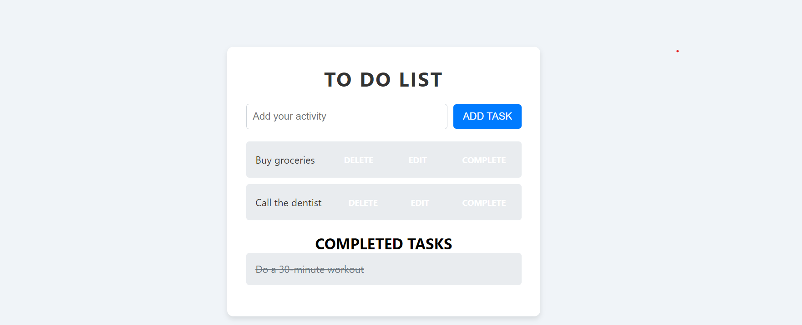

# To-Do List App

A simple web-based To-Do List application built with AngularJS that allows users to manage their daily tasks efficiently.


## Screenshots



## Features

- **Add Tasks**: Easily add new tasks to the list.
- **Edit Tasks**: Modify existing tasks directly.
- **Delete Tasks**: Remove tasks that are no longer needed.
- **Mark as Completed**: Track completed tasks.

## Technologies Used

- **HTML5**: For structuring the application.
- **CSS3**: For styling and layout.
- **AngularJS**: For dynamic functionality and data binding.

## Usage

1. **Clone the Repository**:
   ```bash
   git clone https://github.com/piyush-ghanghav/todo-list-app.git
   ```
2. **Navigate to the Project Directory**:
   ```bash
   cd todo-list-app
   ```
3. **Open `index.html` in your web browser** to start using the To-Do List app.


